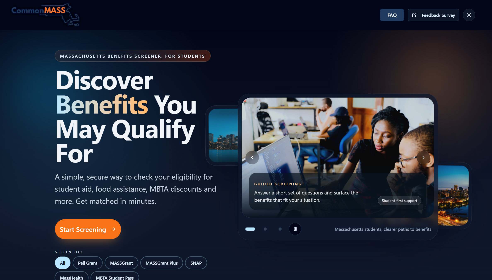

# CommonMASS

**CommonMASS** is a civic technology platform designed to help Massachusetts residents quickly identify public benefits they may qualify for, including student aid, food assistance, and transportation discounts.

Developed as an **IT485 Capstone project at the University of Massachusetts Boston** in collaboration with the **Massachusetts Executive Office of Technology Services and Security (EOTSS)**.

**Live Demo:** [commonmass.org](https://commonmass.org)

---

## Overview

Accessing public benefits can be confusing, fragmented, and time-consuming. Many residents do not know which programs exist, what they qualify for, or where to begin.

CommonMASS addresses that problem through a guided digital experience that helps users:
- answer a short eligibility questionnaire
- view relevant benefit matches
- receive a personalized checklist of next steps
- reduce time spent navigating disconnected websites and requirements

The goal is simple: make public benefits easier to understand and easier to access.

---

## Visual Overview

---

## Why This Project Matters

Public assistance programs are valuable only if people can actually find and use them. Today, that process is often difficult because information is spread across multiple agencies, eligibility rules are unclear, and application steps vary from program to program.

CommonMASS was built to improve that experience by creating a single, user-friendly starting point for benefit discovery.

This project focuses on:
- accessibility
- clarity
- guided decision support
- practical civic impact
- secure cloud-based delivery

---

## Key Features

- **Guided screening experience** for benefit discovery
- **Eligibility-based matching** for relevant programs
- **Personalized checklist generation** for next steps
- **Simple, public-facing interface** designed for ease of use
- **Cloud-hosted deployment** with scalable web delivery
- **Architecture and documentation** prepared for review and future expansion

---

## Project Scope

CommonMASS is intended as a proof-of-concept civic platform that demonstrates how modern cloud architecture, thoughtful user experience, and structured eligibility workflows can improve access to public services.

The project includes:
- a front-end user experience for screening and results
- supporting backend and data structures
- architecture documentation
- deployment through AWS cloud services
- repository standards for collaboration, security, and maintainability

---

## Architecture

System architecture documentation is available in the repository:

- **Editable diagram:** `documentation/architecture/commonmass-aws-architecture.drawio`
- **Viewable export:** `documentation/architecture/commonmass-aws-architecture.png`

This architecture was designed to support a secure, scalable, and maintainable cloud-based deployment model.

---

## Technology Stack

**Frontend**
- React
- TypeScript
- Vite

**Backend / Application Logic**
- Python

**Cloud / Infrastructure**
- AWS
- CloudFront
- S3

**Project Workflow**
- GitHub
- Jira

**DNS / Delivery**
- Cloudflare

---

## Security and Project Standards

This repository includes supporting documentation and standards for maintainability and responsible collaboration, including:

- MIT License
- Code of Conduct
- Contributing Guidelines
- Security Policy

These materials reflect a project structure intended to be professional, reviewable, and scalable beyond a classroom prototype.

---

## Team and Academic Context

CommonMASS was developed through the **University of Massachusetts Boston IT485 Capstone** as a team-based civic technology project in collaboration with the **Massachusetts Executive Office of Technology Services and Security (EOTSS)**.

The project emphasizes:
- applied cloud architecture
- civic technology
- collaborative software delivery
- documentation and system design
- user-centered public service workflows

## Team

**University of Massachusetts Boston – IT485 Capstone Team**

- **Carson Evans** – Technical Lead - Cloud Architect
  Email: `Carson.Evans001@umb.edu`

- **An T Nguyen** – Backend Software Engineer  
  Email: `An.Nguyen009@umb.edu`

- **Cekoi C Smith** – Full Stack Engineer  
  Email: `Cekoi.Smith001@umb.edu`

- **Ryan KetemepiKokou** – Backend Software Engineer  
  Email: `R.KetemepiKokou001@umb.edu`

- **Zain Raza** – Backend Software Engineer  
  Email: `Zain.Raza001@umb.edu`

---

## Developer Documentation

For local installation, environment setup, and running the project in development, see [SETUP.md](./SETUP.md).

For contribution workflow, branching, and pull requests, see [CONTRIBUTING.md](./CONTRIBUTING.md).
